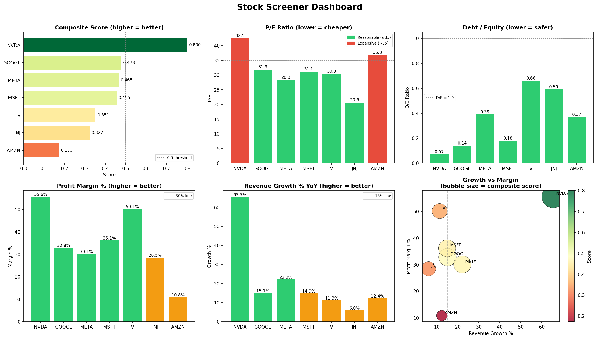

# 📈 Stock Screener with Fundamental Analysis
 
A Python-based quantitative stock screening tool that fetches real financial data from Yahoo Finance (via HuggingFace), computes key fundamental metrics, filters stocks by investment criteria, and visualises results in a multi-panel dashboard.
 
Built as a foundational project at the intersection of **data engineering**, **financial analysis**, and **Python development**.
 
---
 
## 🖼️ Dashboard Preview
 

 
---
 
## 🧠 What This Project Does
 
1. **Fetches real stock data** directly from the [`defeatbeta/yahoo-finance-data`](https://huggingface.co/datasets/defeatbeta/yahoo-finance-data) HuggingFace dataset using DuckDB — no manual downloads required
2. **Computes 5 fundamental financial metrics** from raw income statement and balance sheet data
3. **Screens stocks** by applying configurable thresholds across all metrics
4. **Ranks survivors** using a weighted composite score
5. **Visualises results** in a 6-panel matplotlib dashboard saved to `reports/`
---
 
## 📊 Financial Metrics Computed
 
| Metric | Formula | What It Tells You |
|---|---|---|
| **P/E Ratio** | Price ÷ Diluted EPS | How expensive the stock is relative to earnings |
| **Debt / Equity** | Total Debt ÷ Stockholders Equity | How leveraged the company is |
| **Current Ratio** | Current Assets ÷ Current Liabilities | Whether the company can pay short-term bills |
| **Profit Margin %** | Net Income ÷ Total Revenue × 100 | How much of revenue becomes actual profit |
| **Revenue Growth %** | (This Year Revenue − Last Year Revenue) ÷ Last Year Revenue × 100 | Whether the business is growing |
 
---
 
## 🗂️ Project Structure
 
```
stock-screener/
│
├── data/                        # Parquet files cached locally after first run
│
├── src/
│   ├── __init__.py
│   ├── data_loader.py           # Fetches data from HuggingFace via DuckDB
│   ├── metrics.py               # Computes financial ratios from raw statements
│   ├── screener.py              # Applies filters and ranks stocks by composite score
│   └── visualizer.py           # Generates the 6-panel matplotlib dashboard
│
├── reports/
│   └── screener_dashboard.png   # Output chart (auto-generated on run)
│
├── main.py                      # Entry point — runs the full pipeline
├── requirements.txt
└── README.md
```
 
---
 
## ⚙️ Setup & Installation
 
### Prerequisites
- Python 3.10 or above
- Anaconda (recommended) or pip
### 1. Clone the repository
```bash
git clone https://github.com/YOUR_USERNAME/stock-screener.git
cd stock-screener
```
 
### 2. Create and activate a conda environment
```bash
conda create -n stock-screener python=3.11
conda activate stock-screener
```
 
### 3. Install dependencies
```bash
pip install -r requirements.txt
```
 
### 4. Run the screener
```bash
python main.py
```
 
The dashboard will open automatically and be saved to `reports/screener_dashboard.png`.
 
---
 
## 🎛️ Customisation
 
### Change which stocks are screened
Open `src/data_loader.py` and edit the `SYMBOLS` list:
```python
SYMBOLS = ['AAPL', 'MSFT', 'GOOGL', 'AMZN', 'META', 'TSLA', 'NVDA', 'JPM', 'JNJ', 'V']
```
 
### Change the screening filters
Open `src/screener.py` and adjust the thresholds:
```python
MAX_PE            = 50     # maximum P/E ratio allowed
MAX_DEBT_EQUITY   = 1.5    # maximum debt-to-equity allowed
MIN_CURRENT_RATIO = 1.0    # minimum current ratio required
MIN_PROFIT_MARGIN = 10.0   # minimum profit margin % required
MIN_REV_GROWTH    = 0.0    # minimum revenue growth % required
```
 
### Change the composite score weights
In `src/screener.py`, adjust the weights in the scoring block:
```python
passed["score"] = (
    normalize(passed["pe_ratio"],           higher_is_better=False) * 0.20 +
    normalize(passed["debt_to_equity"],     higher_is_better=False) * 0.20 +
    normalize(passed["current_ratio"],      higher_is_better=True)  * 0.15 +
    normalize(passed["profit_margin_pct"],  higher_is_better=True)  * 0.25 +
    normalize(passed["revenue_growth_pct"], higher_is_better=True)  * 0.20
)
```
 
---
 
## 📦 Data Source
 
All financial data is sourced from the [`defeatbeta/yahoo-finance-data`](https://huggingface.co/datasets/defeatbeta/yahoo-finance-data) dataset on HuggingFace, which aggregates publicly available data from Yahoo Finance, Nasdaq, and the U.S. Department of the Treasury. Data is for **research and educational purposes only**.
 
Tables used:
- `stock_prices` — historical OHLCV price data
- `stock_statement` — income statement and balance sheet (annual & quarterly)
- `stock_profile` — company metadata (sector, industry, employees)
---
 
## 🛠️ Tech Stack
 
| Tool | Purpose |
|---|---|
| **Python 3.11** | Core language |
| **DuckDB** | SQL queries directly on remote Parquet files |
| **Pandas** | Data manipulation and metric computation |
| **Matplotlib** | Dashboard visualisation |
| **HuggingFace Hub** | Dataset hosting and access |
| **PyArrow** | Parquet file reading |
 
---
 
## 📈 Sample Output (10-stock universe)
 
```
======================================================================
         STOCK SCREENER RESULTS — RANKED BY COMPOSITE SCORE
======================================================================
symbol  latest_price  pe_ratio  debt_to_equity  current_ratio  profit_margin_pct  revenue_growth_pct  score
  NVDA        208.27     42.50            0.07           3.91              55.60               65.47  0.800
 GOOGL        344.40     31.86            0.14           2.01              32.81               15.09  0.478
  META        675.03     28.29            0.39           2.60              30.08               22.17  0.465
  MSFT        424.62     31.13            0.18           1.35              36.15               14.93  0.455
     V        309.42     30.34            0.66           1.08              50.14               11.34  0.351
   JNJ        227.50     20.63            0.59           1.03              28.46                6.05  0.322
  AMZN        263.99     36.82            0.37           1.05              10.83               12.38  0.173
======================================================================
```
 
---
 
## 🚀 Potential Extensions
 
- Add more stocks by expanding the `SYMBOLS` list
- Integrate `stock_tailing_eps` for more accurate P/E calculation
- Add a price momentum signal using historical `stock_prices`
- Export results to Excel with `openpyxl`
- Build an earnings surprise predictor using `stock_earning_calendar` + ML
---
 
## 👤 Author
 
**Aditya Sharma**  
Aspiring Quant/ML-Finance Professional  
[GitHub](https://github.com/YOUR_USERNAME) • [LinkedIn](https://linkedin.com/in/YOUR_PROFILE)
 
---
 
## 📄 License
 
This project is for educational and research purposes. Financial data is sourced from publicly available APIs via Yahoo Finance.
 
